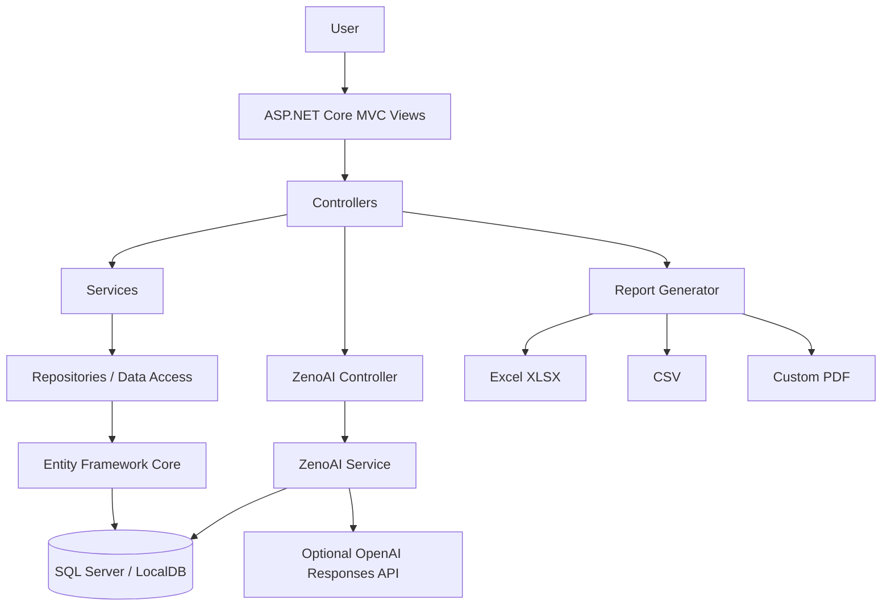
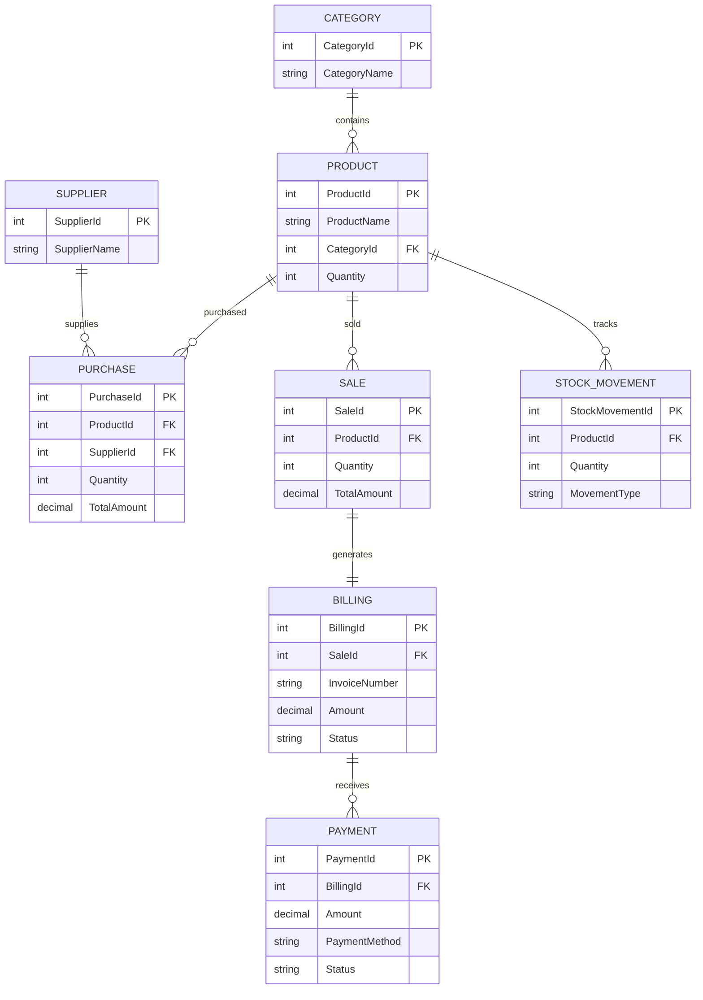
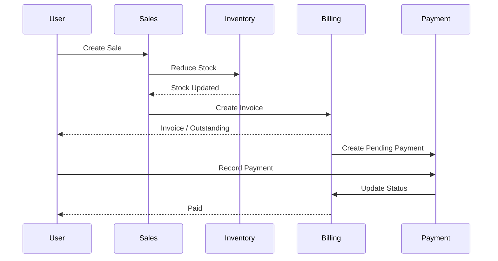
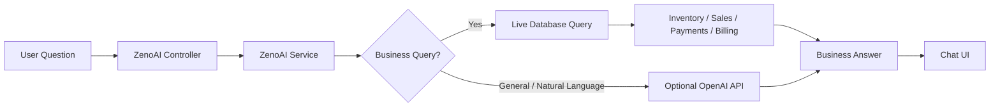
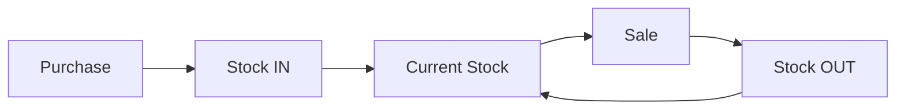
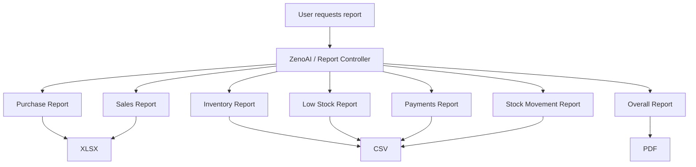
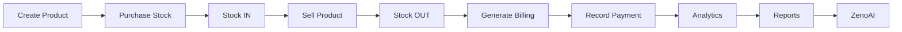

<h1 align="center">🚀 Invenzo — Inventory Management System</h1>

<p align="center">
  <strong>Modern ASP.NET Core MVC Inventory, Sales, Billing & Payment Management System</strong><br/>
  <em>with ZenoAI, dashboards, analytics and downloadable reports</em>
</p>

<p align="center">
  
  
  
  
  
</p>

<p align="center">
  <em>Inventory • Purchases • Sales • Stock Movement • Billing • Payments • Analytics • Reports • ZenoAI</em>
</p>

<p align="center">
  <a href="#-about-the-project">About</a> •
  <a href="#-key-features">Features</a> •
  <a href="#-system-architecture">Architecture</a> •
  <a href="#-database--er-diagram">Database</a> •
  <a href="#-zenoai-data-flow">ZenoAI</a> •
  <a href="#-installation--setup">Setup</a>
</p>

---

<h2>📸 Project Images</h2>

> **Tip:** Add your own application screenshots to `docs/screenshots/` and replace the placeholders below.  
> The repository already contains the Better Insights visual at `wwwroot/images/better-insights.png`.

### Dashboard / Better Insights


### Recommended GitHub Screenshot Layout

Create this folder:

```text
docs/
└── screenshots/
    ├── dashboard.png
    ├── products.png
    ├── categories.png
    ├── suppliers.png
    ├── purchases.png
    ├── sales.png
    ├── billing.png
    ├── payments.png
    ├── stock-movement.png
    ├── zenoai.png
    └── reports.png
```

Then add them here:

```markdown


```

---

<h2>🚀 About the Project</h2>

**Invenzo** is a complete inventory management web application built with **ASP.NET Core MVC** and **Entity Framework Core**.

It manages the complete inventory lifecycle:

**Products → Categories → Suppliers → Purchases → Stock → Sales → Billing → Payments → Reports**

The project also includes **ZenoAI**, an integrated assistant that can answer business questions using live inventory, sales, stock movement, billing and payment data.

---

<h2>✨ Key Features</h2>

<h3>📦 Inventory Management</h3>
- Product management
- Category management
- Supplier management
- Purchase management
- Sales management
- Automatic stock updates
- Stock movement tracking
- Low-stock monitoring

<h3>💰 Billing & Payments</h3>
- Automatic invoice creation after a sale
- Invoice number generation
- Outstanding/Paid billing status
- Pending payment tracking
- Payment recording
- Payment methods:
  - UPI
  - Card
  - Net Banking
  - Cash
- Payment status tracking
- Paid vs pending analytics

<h3>🤖 ZenoAI</h3>

ZenoAI provides a conversational interface for querying live business data.

Examples:

```text
How many products are there?

How many sales have been made?

How many categories do we have?

Show products in Storage category.

Show products in Electronics category.

How many payments are pending?

How many payments are paid?

What is the stock movement?

Which products are low in stock?

How many suppliers do we have?
```

ZenoAI can also provide category-specific product information:

```text
User → Storage category
ZenoAI → Products belonging to Storage + current stock
```

The same workflow works for other categories.

<h3>📊 Dashboard & Analytics</h3>

The dashboard contains:

- Total Products
- Total Categories
- Total Suppliers
- Total Purchases
- Total Sales
- Low Stock

It also includes:

- Stock Overview donut chart
- Monthly Sales graph
- Top Selling Products
- Low Stock Alerts
- Recent Activities
- Better Insights section
- Inventory health information

Charts are rendered without requiring an external charting library:
- Dashboard charts use HTML/CSS/SVG
- PDF charts use custom C# vector drawing

<h3>📄 Reports</h3>

The system supports downloadable reports.

| Report | Format |
|---|---|
| Purchase Report | Excel `.xlsx` |
| Sales Report | Excel `.xlsx` |
| Inventory Report | CSV |
| Low Stock Report | CSV |
| Payments Report | CSV |
| Stock Movement Report | CSV |
| Overall Report | PDF |

The **Overall PDF Report** contains separate report sections/pages for:

1. Monthly Sales
2. Purchase Report
3. Supplier-wise Purchase Chart
4. Sales Report
5. Month-wise Sales Chart
6. Stock Report
7. Stock Health Chart
8. Low Stock Report
9. Low Stock Category Chart
10. Stock Movement Report
11. IN vs OUT Chart
12. Payments Report
13. Paid vs Pending Chart

---

<h2>🏗️ System Architecture</h2>



---

<h2>🗄️ Database / ER Diagram</h2>



---

<h2>🔄 Sales → Billing → Payment Flow</h2>



---

<h2>🤖 ZenoAI Data Flow</h2>



<h3>ZenoAI Business Data</h3>

ZenoAI can work with:

- Products
- Categories
- Suppliers
- Purchases
- Sales
- Current stock
- Stock movements
- Billing
- Payments
- Low-stock products

For important business figures, the application uses deterministic database queries so the response is based on current application data.

---

<h2>💳 Billing & Payment Logic</h2>

When a sale is created:

```text
Sale Created
     ↓
Stock Reduced
     ↓
Billing Invoice Created
     ↓
Billing = Outstanding
     ↓
Pending Payment Created
     ↓
Payment Recorded
     ↓
Billing = Paid
```

<h3>Payment Methods</h3>

```text
UPI
Card
Net Banking
Cash
Pending
```

> **Note:** The current payment module records payment information inside Invenzo. It is not a direct integration with a bank/payment gateway.

---

<h2>📈 Stock Movement</h2>

Stock movements allow the application to track inventory changes.



ZenoAI can answer:

```text
How many stock movements are there?

How many IN movements?

How many OUT movements?

What is the recent stock movement?
```

---

<h2>📊 Report Generation</h2>



---

<h2>🧰 Tech Stack</h2>

| Technology | Purpose |
|---|---|
| C# | Application language |
| .NET 10 | Runtime / framework |
| ASP.NET Core MVC | Web application |
| Entity Framework Core | ORM / database access |
| SQL Server / LocalDB | Database |
| ASP.NET Identity | Authentication & authorization |
| Google Authentication | External login |
| AutoMapper | Object mapping |
| HTML5 | UI |
| CSS3 | Styling |
| JavaScript | Client-side interaction |
| SVG | Dashboard charts |
| OpenAI Responses API | Optional AI layer |
| OpenXML | Excel workbook generation |
| Custom C# PDF generator | Overall PDF reports |

---

<h2>🔐 Authentication & Authorization</h2>

The application uses **ASP.NET Core Identity**.

Roles include:

```text
Admin
Seller
```

Role-based authorization is used to control access to application functionality.

Google authentication is also configured as an optional external authentication provider.

> For production, never commit API keys, client secrets, passwords or connection strings containing credentials to GitHub.

---

<h2>📁 Project Structure</h2>

```text
Invenzo/
│
├── Controllers/
│   ├── DashboardController.cs
│   ├── ProductController.cs
│   ├── CategoryController.cs
│   ├── SupplierController.cs
│   ├── PurchaseController.cs
│   ├── SaleController.cs
│   ├── BillingController.cs
│   ├── PaymentController.cs
│   └── ZenoAIController.cs
│
├── Data/
│   └── ApplicationDbContext / InventoryDbContext
│
├── Models/
│   ├── Product.cs
│   ├── Category.cs
│   ├── Supplier.cs
│   ├── Purchase.cs
│   ├── Sale.cs
│   ├── Billing.cs
│   ├── Payment.cs
│   └── StockMovement.cs
│
├── Repository/
│   └── DashboardRepo/
│
├── Services/
│   ├── DashboardService/
│   └── ZenoAIService/
│
├── ViewModels/
│   └── DashboardVM.cs
│
├── Views/
│   ├── Dashboard/
│   ├── Product/
│   ├── Category/
│   ├── Supplier/
│   ├── Purchase/
│   ├── Sale/
│   ├── Billing/
│   ├── Payment/
│   └── ZenoAI/
│
├── Migrations/
│
├── wwwroot/
│   ├── css/
│   ├── js/
│   └── images/
│
├── Program.cs
├── appsettings.json
└── InventoryManagementSystem.slnx
```

---

<h2>⚙️ Installation & Setup</h2>

<h3>1. Clone the repository</h3>

```bash
git clone https://github.com/YOUR_USERNAME/Invenzo.git
cd Invenzo
```

Replace `YOUR_USERNAME` with your GitHub username.

<h3>2. Restore dependencies</h3>

```bash
dotnet restore
```

<h3>3. Configure SQL Server</h3>

The development configuration uses SQL Server LocalDB:

```text
Server=(localdb)\MSSQLLocalDB;
Database=InventoryDb;
Trusted_Connection=True;
MultipleActiveResultSets=true
```

Update the connection string in `appsettings.json` if your SQL Server configuration is different.

## 4. Apply migrations

If required:

```bash
dotnet ef database update
```

## 5. Run the application

```bash
dotnet run
```

Then open the local URL displayed by ASP.NET Core.

---

<h2>🔑 OpenAI / ZenoAI Configuration</h2>

ZenoAI can operate using the application's deterministic database-query layer. An optional OpenAI API integration is also supported.

Example configuration:

```json
"OpenAI": {
  "ApiKey": "",
  "Model": "gpt-5.6-luna"
}
```

You can also provide the API key through an environment variable:

```text
OPENAI_API_KEY
```

<h3>Security recommendation</h3>

Do **not** put a real API key directly into a public GitHub repository.

For production, prefer:

- Environment variables
- User Secrets
- Azure Key Vault
- GitHub Actions Secrets
- Other secure secret-management systems

---

<h2>🧪 Example ZenoAI Questions</h2>

<h3>Inventory</h3>

```text
How many products are there?
How many categories are there?
How many suppliers are there?
Which products are low in stock?
```

<h3>Categories</h3>

```text
Show products in Storage.
Show products in Electronics.
Show products in Furniture.
```

<h3>Sales</h3>

```text
How many sales have been made?
What is the total sales value?
```

<h3>Payments</h3>

```text
How many payments are done?
How many payments are pending?
How many payments are unpaid?
How much has been paid?
```

<h3>Stock</h3>

```text
What is the stock movement?
How many IN movements are there?
How many OUT movements are there?
```

<h3>Reports</h3>

```text
Generate purchase report.
Generate sales report.
Generate overall report.
```

---

<h2>📦 Database Migration</h2>

The project includes Entity Framework Core migrations.

Important migration areas include:

```text
Products
Categories
Suppliers
Purchases
Sales
Stock Movements
Billing
Payments
Identity
```

The application also performs database migration during startup where configured.

---

<h2>📄 Billing Example</h2>

A typical sale creates:

```text
Sale
 ├── Sale amount
 ├── Product
 ├── Quantity
 └── Stock reduction
       │
       ▼
Billing
 ├── Invoice Number
 ├── Amount
 └── Outstanding
       │
       ▼
Payment
 ├── Amount
 ├── Payment Method
 └── Pending / Paid
```

---

<h2>📊 Dashboard Overview</h2>

The dashboard is designed around quick business visibility.

```text
┌────────────────────────────────────────────────────────────┐
│ Total Products │ Categories │ Suppliers │ Purchases       │
├────────────────────────────────────────────────────────────┤
│ Total Sales    │ Low Stock                                  │
├────────────────────────────────────────────────────────────┤
│ Stock Overview                  │ Monthly Sales             │
├────────────────────────────────┼───────────────────────────┤
│ Better Insights                │ Top Selling Products       │
├────────────────────────────────┼───────────────────────────┤
│ Low Stock Alerts               │ Recent Activities          │
└────────────────────────────────┴───────────────────────────┘
```

---

<h2>🖼️ Adding Screenshots to GitHub</h2>

For the best README presentation, take screenshots of:

1. Login page
2. Dashboard
3. Products
4. Categories
5. Suppliers
6. Purchases
7. Sales
8. Billing
9. Payments
10. Stock Movement
11. ZenoAI
12. Reports

Save them under:

```text
docs/screenshots/
```

Recommended naming:

```text
01-login.png
02-dashboard.png
03-products.png
04-categories.png
05-suppliers.png
06-purchases.png
07-sales.png
08-billing.png
09-payments.png
10-stock-movement.png
11-zenoai.png
12-reports.png
```

Then reference them in this README:

```markdown
## Dashboard


## ZenoAI


```

---

<h2>🛡️ Security</h2>

Before pushing to GitHub:

- Remove real API keys.
- Do not commit passwords.
- Do not commit production connection strings.
- Keep authentication secrets outside source control.
- Use environment variables or secret managers.
- Review `appsettings.json` before publishing.

Recommended `.gitignore` entries:

```gitignore
bin/
obj/
.vs/
*.user
*.suo
appsettings.Production.json
secrets.json
```

---

<h2>🌱 Future Improvements</h2>

Possible future extensions:

- Real payment gateway integration
- Barcode / QR scanning
- Email invoices
- PDF invoice download
- Advanced sales forecasting
- AI-based demand prediction
- Supplier performance analytics
- Multi-warehouse inventory
- Product image management
- Audit logs
- REST API
- Mobile application
- Cloud deployment
- Real-time notifications

---

<h2>👨‍💻 Development Workflow</h2>



---

<h2>📌 Important Notes</h2>

- **ZenoAI is an application assistant**, not a replacement for accounting or financial software.
- Payment recording is currently an internal application workflow, not a payment gateway.
- Report generation is performed by the application itself.
- The overall report is generated as a PDF.
- Sales and purchase reports are generated as Excel workbooks.
- Inventory, payment, low-stock and stock-movement reports can be exported as CSV.

---

<h2>📜 License</h2>

This project currently does not declare a specific open-source license.

If you plan to publish it publicly, add a license such as MIT before presenting it as an open-source project.

Example:

```text
Copyright (c) 2026

Permission is hereby granted, free of charge, to any person obtaining a copy
of this software and associated documentation files...
```

---

<h2>⭐ Project Summary</h2>

**Invenzo** combines traditional inventory management with business analytics and an AI assistant in one ASP.NET Core MVC application.

### Core modules

```text
Inventory
    +
Purchases
    +
Sales
    +
Stock Movement
    +
Billing
    +
Payments
    +
Dashboard Analytics
    +
Reports
    +
ZenoAI
    =
INVENZO
```

<p align="center">
  <strong>Invenzo — Manage Inventory. Track Sales. Understand Your Business.</strong>
</p>
